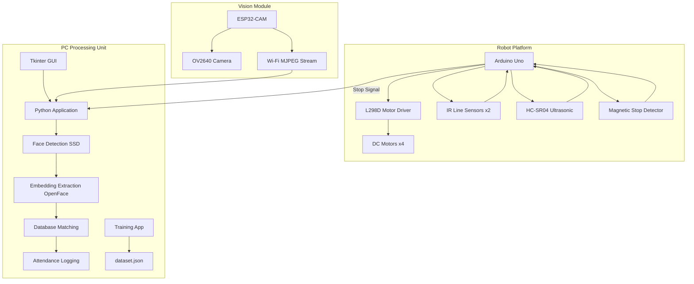
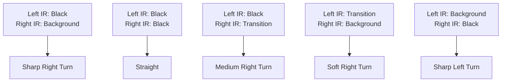

# Surveillance Robot — Employees Attendance

<div align="center">

**An Autonomous Mobile Robot System for Employee Attendance Tracking Using Real-Time Face Recognition**

[](https://github.com/AhmadYamen-Radwan)
[](https://www.python.org/)
[](https://opencv.org/)
[](https://www.arduino.cc/)
[](https://www.espressif.com/)
[](LICENSE)

</div>

---

## 📋 Table of Contents

- [Overview](#-overview)
- [Key Features](#-key-features)
- [System Architecture](#-system-architecture)
- [Technology Stack](#-technology-stack)
- [Hardware Components](#-hardware-components)
- [Software Modules](#-software-modules)
- [Robot Navigation & Control](#-robot-navigation--control)
- [Face Recognition Pipeline](#-face-recognition-pipeline)
- [Performance Results](#-performance-results)
- [Getting Started](#-getting-started)
- [Project Structure](#-project-structure)
- [Future Improvements](#-future-improvements)
- [Contributing](#-contributing)
- [License](#-license)
- [Contact](#-contact)

---

## 🎯 Overview

**Surveillance Robot — Employees Attendance** is a comprehensive autonomous mobile robot system designed to modernize workplace attendance tracking. The robot autonomously navigates through office environments, visits designated locations, performs real-time face recognition, and logs employee attendance with timestamps and location data. This system eliminates traditional attendance fraud, reduces administrative overhead, and provides accurate verification of employee presence at their actual workstations.

### Problem Addressed

Traditional attendance systems (manual signatures, ID cards, fingerprint scanners) suffer from:
- ❌ Physical contact requirements
- ❌ Vulnerability to fraud (buddy punching)
- ❌ Long queues at central checkpoints
- ❌ Inability to verify employee location within the workspace
- ❌ Lack of granularity for multi-department organizations

### Our Solution

An autonomous robot that:
- ✅ Physically verifies presence at the employee's workspace
- ✅ Uses contactless AI-powered face recognition
- ✅ Provides real-time attendance logging with location data
- ✅ Operates autonomously with minimal human intervention
- ✅ Reduces administrative overhead and human error

---

## ⚡ Key Features

### Robot Navigation
- **Fuzzy Logic Line Following**: Smooth, robust path tracking using fuzzy logic controllers
- **Stop Detection**: Magnetic marker detection for precise office stops
- **Obstacle Avoidance**: Ultrasonic sensor-based collision avoidance
- **Automatic Return**: Returns to base station after completing the tour

### Face Recognition
- **Real-Time Detection**: SSD-based face detection in video streams
- **Deep Learning Embeddings**: OpenFace 128-dimensional feature vectors
- **Accurate Matching**: Cosine similarity with dual-threshold confidence system
- **Employee Database**: JSON-based profile management with geometric median embedding

### User Interface
- **Live Video Stream**: Real-time monitoring with face overlays
- **Attendance Logs**: Timestamped records with employee names and confidence scores
- **Profile Management**: Easy employee registration and database updates
- **Admin Dashboard**: Comprehensive monitoring and control interface

---

## 🏗️ System Architecture



### Data Flow

1. **Robot Navigation**: Arduino reads sensors → Fuzzy logic computes motor speeds → Robot follows line
2. **Stop Detection**: Magnetic marker detected → Arduino sends "Stop" signal to PC
3. **Face Capture**: ESP32-CAM streams video → PC captures frame during 10-second dwell
4. **Face Processing**: SSD detects faces → OpenFace extracts embeddings → Matching against database
5. **Attendance Logging**: Recognized employees logged with timestamp and confidence → GUI updated

---

## 💻 Technology Stack

| Component | Technology | Purpose |
|-----------|------------|---------|
| **Robot Controller** | C++ (Arduino) | Motor control, sensor fusion, fuzzy logic navigation |
| **Vision Module** | C++ (ESP32) | Camera initialization, MJPEG streaming, Wi-Fi connectivity |
| **Recognition Engine** | Python 3.8+ | Face detection, embedding extraction, matching algorithm |
| **Deep Learning** | OpenCV, OpenFace (Torch) | SSD face detection, 128D embedding extraction |
| **User Interface** | Tkinter | Admin dashboard, live video, profile management |
| **Data Storage** | JSON | Employee database, attendance logs |
| **Communication** | HTTP/MJPEG, Serial | Video streaming, robot-PC communication |

---

## 🔧 Hardware Components

### Robot Platform (Arduino-Based)

| Component | Model/Type | Function |
|-----------|------------|----------|
| **Microcontroller** | Arduino Uno | Central control for motor and sensors |
| **Motor Driver** | L298D Shield | Drives 4 DC motors with PWM control |
| **DC Motors** | 4x 12V, 100 RPM | Differential drive wheel motion |
| **Line Sensors** | TCRT5000 (Analog) | Black line detection for path following |
| **Obstacle Sensor** | HC-SR04 (Ultrasonic) | Obstacle detection (≤ 20 cm range) |
| **Stop Detection** | Magnetic Sensor | Detects magnetic markers at office locations |
| **Power** | 2x 18650 Li-ion (7.4V) | Motor and Arduino power supply |

### Vision Module (ESP32-CAM)

| Component | Specification |
|-----------|---------------|
| **Module** | AI-Thinker ESP32-CAM |
| **Camera** | OV2640 (2MP) |
| **Resolution** | Up to 1600×1200 |
| **Stream Format** | MJPEG over HTTP |
| **Discovery** | mDNS (esp32cam.local) + UDP broadcast |
| **Power** | 5V DC (via FTDI/USB) |

### PC Processing Unit

- **OS**: Windows/Linux/macOS
- **Python**: 3.8 or later
- **Requirements**: Sufficient CPU/GPU for real-time deep learning inference
- **Storage**: Employee database (dataset.json), attendance logs (attendance.log)

---

## 📦 Software Modules

### Embedded Software

#### Arduino (`robot_code.cpp`)
- **Sensor Reading**: IR sensors, ultrasonic, magnetic detector
- **Fuzzy Logic Controller**: 9-rule inference system for line following
- **Motor Control**: PWM signal generation for differential steering
- **Stop Detection**: Office marker detection with 10-second dwell
- **Obstacle Avoidance**: Reactive collision handling
- **Return to Base**: Auto-return after completing tour

#### ESP32-CAM (`esp32_main.cpp`, `app_httpd.cpp`)
- **Wi-Fi Configuration**: Connection to pre-configured network
- **Camera Initialization**: OV2640 setup with JPEG compression
- **mDNS Discovery**: Hostname broadcast (esp32cam.local)
- **UDP Broadcast**: Periodic IP address and hostname announcement
- **MJPEG Server**: HTTP endpoint serving continuous video stream

### PC Application (Python)

#### Core Modules

| Module | File | Responsibility |
|--------|------|----------------|
| **Face Recognition** | `embedding_engine.py` | SSD face detection, OpenFace embedding extraction |
| **Recognition Engine** | `recognition_engine.py` | Multi-threaded pipeline, matching, database management |
| **User Interface** | `interface.py` | Tkinter GUI, live video display, admin controls |
| **Training App** | `training_app.py` | Employee registration, embedding generation |
| **Configuration** | `engine_configuration.py` | System settings, config.yaml management |
| **Data Models** | `face_profile.py` | FaceProfile dataclass for structured face data |
| **Camera Utils** | `camera_config.py` | Save/load camera selection preferences |

---

## 🤖 Robot Navigation & Control

### Fuzzy Logic Line Following

The robot uses a fuzzy logic controller for smooth and robust line following, chosen over PID for its superior handling of non-linearities and sensor uncertainties.

#### Input Variables
- **Left IR Value**: Analog reading (0-1023) from left TCRT5000 sensor
- **Right IR Value**: Analog reading from right sensor

#### Fuzzification (Membership Functions)

| Linguistic Label | Left IR Range | Right IR Range | Region |
|------------------|---------------|----------------|--------|
| **Black** | 0 – 250 | 0 – 250 | Line is dark |
| **Dark Grey** | 125 – 500 | 125 – 500 | Edge of line |
| **Transition** | 300 – 750 | 300 – 750 | Line boundary |
| **Background** | 500 – 1023 | 500 – 1023 | Floor is light |

#### Fuzzy Rules (9 Core Rules)



#### Defuzzification & Motor Control

1. **Rule Activation**: Each rule produces a `μ` (degree of activation) value
2. **Speed Calculation**: 
   ```
   M1 = max(μ1*200, μ2*180, μ3*150, μ4*200, μ5*100, μ6*200, μ7*-150, μ8*-150, μ9*180, μ10*130)
   ```
3. **Normalization**:
   ```
   Max = max(|M1|, |M2|, |M3|, |M4|)
   Mi_norm = (Mi / Max) * 255
   ```
4. **Final Wheel Speeds**:
   ```
   LeftSpeed = (M1_norm + M4_norm) / 2
   RightSpeed = (M2_norm + M3_norm) / 2
   ```

### Stop Detection at Offices

- **Method**: Magnetic markers placed on the line at each office
- **Detection**: Dedicated magnetic sensor on robot
- **Action**: Motors stop → 10-second dwell time for face recognition
- **Resume**: After dwell time, robot continues to next office

### Obstacle Avoidance

1. **Detection**: HC-SR04 ultrasonic sensor (threshold: 20 cm)
2. **Emergency Stop**: Immediate halt
3. **Backward Movement**: Reverse for 400 ms
4. **Turn**: Rotate left/right for 500 ms
5. **Resume**: Reacquire line and continue

### Return to Base

- **State**: After last office visit, robot ignores magnetic markers
- **Action**: Continues following line to starting point
- **Stop**: Unique marker signals completion of tour

---

## 👤 Face Recognition Pipeline

### Overview


### 1. Face Detection (SSD)

- **Model**: Caffe-based Single Shot Detector
- **Preprocessing**: Resize to 300×300, subtract mean RGB (104.0, 177.0, 123.0)
- **Confidence Threshold**: 0.5 for valid detections
- **Output**: Bounding boxes scaled back to original image dimensions

### 2. Face Embedding Extraction (OpenFace)

- **Model**: OpenFace (Torch-based, FaceNet architecture)
- **Preprocessing**: Resize to 96×96, normalize to [0, 1]
- **Output**: 128-dimensional L2-normalized unit vector
- **Training Data**: FaceScrub and CASIA-WebFace

### 3. Database Management

- **Storage**: JSON format (`dataset.json`)
- **Structure**: List of employee names + embeddings
- **Registration**: `training_app.py` utility
  - Select multiple images per employee
  - Compute geometric median of embeddings (robust to outliers)
  - L2-normalize final embedding
  - Append to database

### 4. Matching Algorithm

- **Metric**: Cosine similarity
- **Formula**: `Cosine_similarity = 1 - cosine_distance`

#### Thresholds

| Threshold | Value | Action |
|-----------|-------|--------|
| **Min_confidence** | 0.5 | Confident match → Green bounding box with name |
| **Unknown_avoid_threshold** | 0.35 | Potential match → Display with lower confidence |
| **Below 0.35** | - | Unknown → Save crop for review, list in "Unknown Profiles" |

### 5. Attendance Logging

**Process**:
1. Arduino sends "Stop" signal to PC
2. PC captures a single frame from video stream
3. Face recognition pipeline processes the frame
4. Logs recognized employees with:
   - Timestamp
   - Employee Name
   - Office Number
   - Confidence Score
   - Status ("PRESENT")
5. If no faces detected within 5 seconds: Logs "No employee present"
6. GUI updates in real-time
7. Robot resumes movement after dwell time

---

## 📊 Performance Results

### Face Recognition Accuracy

| Condition | Accuracy | Processing Time |
|-----------|----------|-----------------|
| **Normal Lighting** | 92% | 0.71 seconds/frame |
| **Low Light** | ~75% | 0.80 seconds/frame |
| **Backlit** | ~70% | 0.85 seconds/frame |

### Navigation Performance

| Metric | Result |
|--------|--------|
| **Line Following** | Smooth, within ±2 cm deviation |
| **Curve Handling** | Successful at 90° turns |
| **Stop Precision** | ±1 cm at magnetic markers |
| **Obstacle Avoidance** | 100% success at 20 cm threshold |
| **Route Completion** | 100% for predefined paths |

### System Performance

- **Video Latency**: ~200 ms (ESP32-CAM MJPEG stream)
- **Recognition Pipeline**: 0.71 seconds per frame
- **Database Lookup**: < 50 ms for 50 employees
- **GUI Refresh Rate**: 30 fps

---

## 🚀 Getting Started

### Prerequisites

| Requirement | Specification |
|-------------|---------------|
| **Python** | 3.8 or higher |
| **Arduino IDE** | 1.8.x or higher |
| **ESP32 Board Support** | ESP32 package in Arduino IDE |
| **PC** | Modern CPU (quad-core recommended) |
| **Operating System** | Windows/Linux/macOS |
| **Camera** | USB or built-in (for testing) |

### Hardware Assembly

1. **Robot Chassis**:
   - Assemble 4-wheel differential drive chassis
   - Mount Arduino Uno with L298D shield
   - Install TCRT5000 sensors at front (straddling line)
   - Mount HC-SR04 ultrasonic sensor at front
   - Install magnetic sensor underneath

2. **ESP32-CAM Setup**:
   - Connect OV2640 camera to ESP32-CAM
   - Flash with provided firmware
   - Configure Wi-Fi credentials
   - Verify stream at `http://esp32cam.local/stream`

3. **Power System**:
   - Connect 18650 batteries (7.4V) to motor driver
   - Power Arduino via USB or battery
   - Power ESP32-CAM via 5V FTDI/USB

### Software Installation

#### 1. Clone the Repository
```bash
git clone https://github.com/AhmadYamen-Radwan/Surveillance-Robot-Employees-Attendance.git
cd Surveillance-Robot-Employees-Attendance
```

#### 2. Create Python Virtual Environment
```bash
python3 -m venv venv
source venv/bin/activate  # Linux/macOS
# or
venv\Scripts\activate     # Windows
```

#### 3. Install Python Dependencies
```bash
pip install -r requirements.txt
```

#### 4. Arduino Setup
- Open `robot_code.cpp` in Arduino IDE
- Install required libraries (if any)
- Upload to Arduino Uno

#### 5. ESP32-CAM Setup
- Open `esp32_main.cpp` in Arduino IDE
- Configure Wi-Fi SSID and password
- Upload to ESP32-CAM
- Wait for LED to indicate Wi-Fi connection

#### 6. Configure System
Edit `config.yaml`:
```yaml
camera:
  source: http://esp32cam.local/stream  # or local camera: 0
  width: 640
  height: 480

recognition:
  model: models/openface.t7
  min_confidence: 0.5
  unknown_avoid_threshold: 0.35

robot:
  offices: 5
  dwell_time: 10  # seconds
  stop_marker: magnetic
```

### Running the System

#### Start the Recognition Engine
```bash
python backend/app.py
```

#### Start the GUI
```bash
python interface.py
```

#### Register Employees
```bash
python training_app.py
```

#### Robot Controller (on robot)
```bash
python robot/controller.py --config config.yaml
```

### Docker Support
```bash
cd docker
docker build -t surveillance-robot .
docker run -p 8000:8000 surveillance-robot
```

---

## 📁 Project Structure

```
Surveillance-Robot-Employees-Attendance/
├── backend/
│   ├── app.py                    # Main application entry point
│   ├── recognition_engine.py     # Core recognition logic
│   ├── embedding_engine.py       # Face detection & embedding extraction
│   ├── engine_configuration.py   # Configuration management
│   ├── face_profile.py           # Face data structures
│   └── camera_config.py          # Camera utilities
├── interface/
│   ├── interface.py              # Tkinter GUI
│   └── assets/                   # GUI assets (icons, etc.)
├── robot/
│   ├── controller.py             # Robot communication
│   ├── robot_code.cpp            # Arduino firmware
│   └── routes/                   # Route definitions
├── vision/
│   ├── esp32_main.cpp            # ESP32-CAM firmware
│   ├── app_httpd.cpp             # HTTP/MJPEG server
│   └── models/                   # Pre-trained models
│       ├── deploy.prototxt       # SSD model architecture
│       ├── detector_model.caffemodel  # SSD weights
│       └── openface.t7           # OpenFace model
├── scripts/
│   ├── init_db.py                # Database initialization
│   ├── train_recognition.py      # Model training scripts
│   └── test_motors.py            # Motor testing utility
├── training_app.py               # Employee registration utility
├── config.yaml                   # System configuration
├── dataset.json                  # Employee database
├── attendance.log                # Attendance logs
├── requirements.txt              # Python dependencies
├── docker/
│   └── README.md                 # Docker instructions
└── docs/
    ├── hardware_setup.md         # Hardware assembly guide
    └── api_reference.md          # API documentation
```

---

## 🔮 Future Improvements

### Advanced Navigation
| Improvement | Description |
|-------------|-------------|
| **SLAM Implementation** | Replace line following with simultaneous localization and mapping |
| **ROS Integration** | Use Robot Operating System for advanced control |
| **Lidar/Depth Cameras** | Intel RealSense or similar for 3D mapping |
| **Dynamic Route Planning** | Adaptive path planning based on office layout |

### Enhanced Face Recognition
| Improvement | Description |
|-------------|-------------|
| **Low-Light Performance** | ESP32-CAM LED flashlight, IR cameras |
| **Liveness Detection** | Eye blinking, head movement checks to prevent photo fraud |
| **Model Fine-Tuning** | Transfer learning on employee dataset |
| **Multi-Face Processing** | Simultaneous recognition of multiple employees |

### System Scalability
| Improvement | Description |
|-------------|-------------|
| **Multi-Robot Integration** | Multiple robots communicating with central server |
| **REST API** | Integration with HR and payroll systems |
| **Cloud Deployment** | Centralized logging and management |
| **Role-Based Access** | Admin, manager, employee dashboards |

### Hardware Upgrades
| Improvement | Description |
|-------------|-------------|
| **Single Board Computer** | Raspberry Pi 4/5 for onboard processing |
| **Onboard AI Inference** | Edge TPU, NVIDIA Jetson for accelerated inference |
| **Intelligent Power Management** | Self-charging docking station |
| **24/7 Autonomous Operation** | Return to base, recharge, continue |

---

## 🤝 Contributing

We welcome contributions! Please follow these steps:

1. **Fork the repository**
2. **Create a feature branch**
   ```bash
   git checkout -b feat/your-feature-name
   ```
3. **Commit your changes**
   ```bash
   git commit -m "Add your feature description"
   ```
4. **Push to the branch**
   ```bash
   git push origin feat/your-feature-name
   ```
5. **Open a Pull Request**

### Contribution Guidelines
- Follow existing code style and conventions
- Add tests for new functionality
- Update documentation (README, comments, docstrings)
- Include hardware specifications for any hardware changes
- Provide clear description of changes in PR

---

## 📄 License

This project is licensed under the **MIT License**. See the [LICENSE](LICENSE) file for details.

---

## 📞 Contact

**Author:** Ahmad Yamen AbdulKader Radwan  
**Supervisor:** Dr. Eng. Issa Al-Ghannam  

**Institution:** Tishreen University (Latakia University)  
**Faculty:** Mechanical and Electrical Engineering  
**Major:** Mechatronics Engineering  

[](https://github.com/AhmadYamen-Radwan)
[](mailto:ahmad.yamen.radwan@example.com)

---

<div align="center">

**Surveillance Robot — Employees Attendance**  
*An Autonomous Mobile Robot for Modern Workforce Management*

[](https://github.com/AhmadYamen-Radwan/Surveillance-Robot-Employees-Attendance)
[](https://github.com/AhmadYamen-Radwan/Surveillance-Robot-Employees-Attendance)

*Tishreen University - Mechatronics Engineering Department*  
*2026*

</div>
